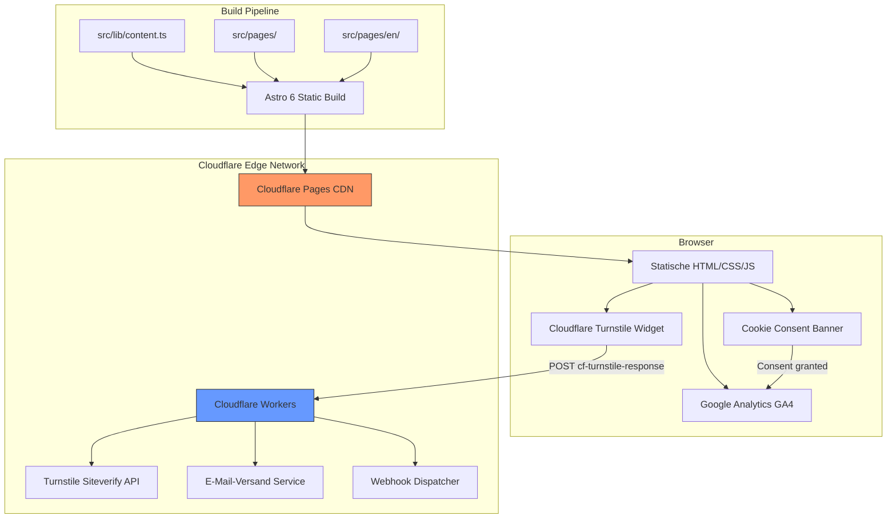
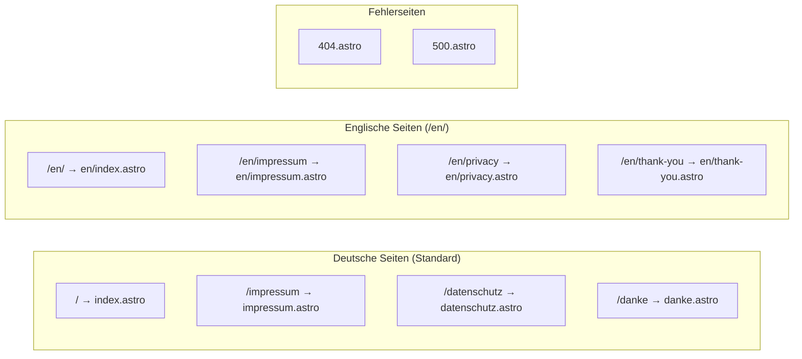
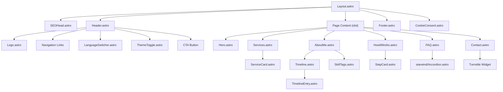
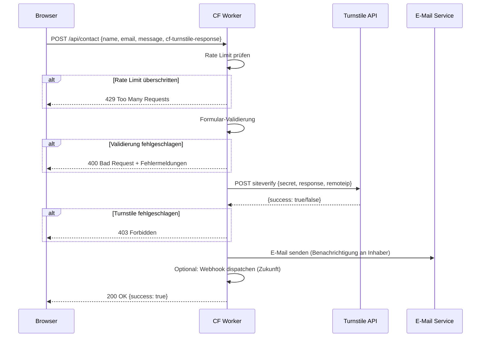

# Design-Dokument: Corporate Website

## Übersicht

Dieses Design-Dokument beschreibt die technische Architektur und Implementierung der Unternehmenswebsite unter www.jonaswestphal.de. Die Website wird auf Basis des [astro-validation-landing](https://github.com/Sebasala/astro-validation-landing) Templates entwickelt und zu einer zweisprachigen (DE/EN) Corporate-Präsenz für IT & Cloud Solutions erweitert.

### Zentrale Design-Entscheidungen

1. **Astro 6 mit statischem Output**: Alle Seiten werden zur Build-Zeit generiert. Kein SSR, kein JavaScript im Browser (außer für interaktive Inseln wie FAQ-Accordion, Cookie-Banner, Dark-Mode-Toggle und Kontaktformular).
2. **i18n über Verzeichnisstruktur**: Astros eingebautes i18n-Routing mit `prefixDefaultLocale: false` – Deutsche Seiten unter `/`, englische unter `/en/`. Sprachspezifische Inhalte werden aus `src/lib/content.ts` geladen.
3. **Cloudflare-Stack**: Hosting auf Cloudflare Pages (Free Tier), Kontaktformular-Verarbeitung über Cloudflare Workers, Bot-Schutz via Cloudflare Turnstile.
4. **Starwind UI als Komponentenbasis**: Wiederverwendbare, barrierefreie Astro-Komponenten (Accordion, Button, Card etc.) aus Starwind UI, angepasst an die Corporate Identity.
5. **Zentrale Inhaltsverwaltung**: Alle Texte, Links und Konfigurationen in `src/lib/content.ts` – eine Datei pro Locale-Objekt, typisiert mit TypeScript.

### Forschungsergebnisse

- **astro-validation-landing Template**: Bietet eine vollständige One-Page-Struktur mit Header, Hero, Problem/Solution, Features, How It Works, Testimonials, CTA, FAQ und Footer. Alle Inhalte werden zentral in `src/lib/content.ts` verwaltet. Design-Tokens liegen in `src/styles/starwind.css`. Das Template nutzt Starwind UI Primitives und Tailwind CSS v4.
- **Astro i18n-Routing**: Astro bietet eingebautes i18n-Routing über `astro.config.mjs` mit `defaultLocale`, `locales` und `prefixDefaultLocale`. Helper-Funktionen wie `getRelativeLocaleUrl()` aus `astro:i18n` ermöglichen korrekte Link-Generierung. Lokalisierte Seiten werden über Verzeichnisstruktur (`src/pages/en/`) organisiert.
- **Starwind UI**: Eine shadcn-inspirierte Komponentenbibliothek für Astro mit Tailwind CSS v4. Komponenten werden per CLI direkt ins Projekt kopiert und können frei angepasst werden. Alle Komponenten unterstützen Dark Mode und sind barrierefrei.
- **Cloudflare Workers + Turnstile**: Turnstile liefert ein Token auf der Client-Seite, das serverseitig über die Siteverify-API validiert wird. Workers können E-Mails über Cloudflare Email Service oder externe Dienste (Resend, Mailgun) versenden. Rate Limiting ist über die Workers-API möglich.

---

## Architektur

### Systemübersicht



### Routing-Architektur



### Astro-Konfiguration (i18n)

```typescript
// astro.config.mjs
import { defineConfig } from "astro/config";
import tailwindcss from "@tailwindcss/vite";

export default defineConfig({
  site: "https://www.jonaswestphal.de",
  i18n: {
    defaultLocale: "de",
    locales: ["de", "en"],
    routing: {
      prefixDefaultLocale: false,
      redirectToDefaultLocale: false,
    },
  },
  vite: {
    plugins: [tailwindcss()],
  },
});
```

---

## Komponenten und Schnittstellen

### Verzeichnisstruktur (erweitert vom Template)

```
.
├── public/
│   ├── favicon.ico
│   ├── og-image.png
│   ├── robots.txt
│   └── sitemap.xml          (generiert via @astrojs/sitemap)
├── src/
│   ├── components/
│   │   ├── Header.astro       (Navigation + Sprachwechsler + Dark-Mode-Toggle)
│   │   ├── Hero.astro
│   │   ├── Services.astro     (ersetzt Description.astro / Features.astro)
│   │   ├── AboutMe.astro      (Profil-Sektion)
│   │   ├── Timeline.astro     (Vertikaler Zeitstrahl)
│   │   ├── TimelineEntry.astro
│   │   ├── HowItWorks.astro
│   │   ├── FAQ.astro
│   │   ├── Contact.astro      (Kontaktformular + Turnstile)
│   │   ├── CookieConsent.astro
│   │   ├── Footer.astro
│   │   ├── Logo.astro
│   │   ├── LanguageSwitcher.astro
│   │   ├── ThemeToggle.astro
│   │   ├── SkillTags.astro    (Technologie-Tags)
│   │   ├── ServiceCard.astro
│   │   ├── StepCard.astro
│   │   ├── SEOHead.astro      (Meta-Tags, hreflang, JSON-LD)
│   │   └── starwind/          (Starwind UI Primitives)
│   │       ├── Accordion.astro
│   │       ├── Button.astro
│   │       ├── Card.astro
│   │       ├── Input.astro
│   │       ├── Textarea.astro
│   │       ├── Label.astro
│   │       └── Badge.astro
│   ├── layouts/
│   │   └── Layout.astro       (Basis-Layout mit SEOHead, Header, Footer)
│   ├── lib/
│   │   ├── content.ts         (Zentrale Inhaltsverwaltung)
│   │   ├── i18n.ts            (Locale-Hilfsfunktionen)
│   │   └── types.ts           (TypeScript-Typdefinitionen)
│   ├── pages/
│   │   ├── index.astro        (Deutsche Startseite)
│   │   ├── impressum.astro
│   │   ├── datenschutz.astro
│   │   ├── danke.astro
│   │   ├── 404.astro
│   │   ├── 500.astro
│   │   └── en/
│   │       ├── index.astro    (Englische Startseite)
│   │       ├── impressum.astro
│   │       ├── privacy.astro
│   │       └── thank-you.astro
│   └── styles/
│       └── starwind.css       (Design-Tokens + Corporate Identity)
├── worker/
│   ├── src/
│   │   ├── index.ts           (Worker Entry Point)
│   │   ├── turnstile.ts       (Turnstile-Validierung)
│   │   ├── email.ts           (E-Mail-Versand)
│   │   ├── webhook.ts         (Webhook-Dispatcher – Zukunft)
│   │   ├── rate-limiter.ts    (Rate Limiting)
│   │   └── validation.ts      (Formular-Validierung)
│   ├── wrangler.toml
│   └── package.json
├── astro.config.mjs
└── starwind.config.json
```

### Komponentenhierarchie



### Schlüsselkomponenten

#### Layout.astro
- Empfängt `locale` als Prop (Standard: `"de"`)
- Setzt `<html lang={locale}>` und lädt die passenden Inhalte aus `content.ts`
- Bindet `SEOHead.astro` mit locale-spezifischen Meta-Tags ein
- Rendert Header, Slot (Seiteninhalt), Footer und CookieConsent
- Injiziert Google Analytics Script nur wenn Cookie-Consent erteilt

#### Header.astro
- Responsive Navigation mit Mobile-Hamburger-Menü
- Smooth-Scroll-Links zu Sektions-Anchors (`#hero`, `#services`, `#about`, `#how-it-works`, `#faq`, `#contact`)
- Enthält `LanguageSwitcher.astro` für DE/EN-Umschaltung
- Enthält `ThemeToggle.astro` für Dark/Light-Mode
- Prominenter CTA-Button für Kontaktaufnahme

#### LanguageSwitcher.astro
- Nutzt `Astro.currentLocale` und `getRelativeLocaleUrl()` aus `astro:i18n`
- Generiert Link zur äquivalenten Seite in der anderen Sprache
- Erhält den aktuellen Sektions-Kontext (Anchor) beim Sprachwechsel

#### SEOHead.astro
- Rendert `<title>`, `<meta name="description">`, Open Graph Tags, Twitter Cards
- Generiert `<link rel="alternate" hreflang="de|en|x-default">` Tags
- Setzt `<link rel="canonical">` auf die sprachspezifische URL
- Injiziert JSON-LD Structured Data (Organization + LocalBusiness Schema)

#### Timeline.astro / TimelineEntry.astro
- Vertikaler Zeitstrahl mit CSS-basierter Linie und Punkten
- Responsive: Auf Desktop links/rechts alternierend, auf Mobile einspaltiges Layout
- Jede `TimelineEntry` zeigt: Zeitraum, Rolle, Unternehmen, Beschreibung
- Daten kommen aus `content.timeline` Array

#### Contact.astro
- Formular mit Name, E-Mail, Nachricht (Pflichtfelder)
- Client-seitige Validierung mit nativen HTML5-Attributen + JavaScript-Feedback
- Cloudflare Turnstile Widget eingebettet
- `<form>` sendet POST an Cloudflare Worker Endpoint
- Fehler- und Erfolgsmeldungen in aktiver Locale
- Redirect zur Danke-Seite nach erfolgreicher Absendung

#### CookieConsent.astro
- Wird als Astro-Insel mit `client:load` hydratisiert
- Zeigt Banner beim ersten Besuch (kein Consent in localStorage)
- Drei Optionen: Alle akzeptieren, Nur notwendige, Einstellungen anpassen
- Speichert Consent-Entscheidung in localStorage
- Lädt GA4-Script dynamisch nur bei Analytics-Consent
- Revoke-Link im Footer zum erneuten Anzeigen des Banners

### Cloudflare Worker – Kontaktformular-API



#### Worker-Architektur

```typescript
// worker/src/index.ts – Modularer Aufbau
interface Env {
  TURNSTILE_SECRET_KEY: string;
  EMAIL_TO: string;
  EMAIL_FROM: string;
  RESEND_API_KEY: string;       // oder anderer E-Mail-Service
  RATE_LIMIT: KVNamespace;      // KV für Rate Limiting
  WEBHOOK_URLS?: string;        // Komma-separierte Webhook-URLs (Zukunft)
}
```

Der Worker ist modular aufgebaut:
- **`index.ts`**: Entry Point, CORS-Handling, Request-Routing
- **`validation.ts`**: Validiert Pflichtfelder (Name, E-Mail-Format, Nachricht nicht leer)
- **`turnstile.ts`**: Verifiziert das Turnstile-Token über die Siteverify-API
- **`rate-limiter.ts`**: IP-basiertes Rate Limiting über Cloudflare KV (z.B. max. 5 Anfragen pro IP pro Stunde)
- **`email.ts`**: Sendet E-Mail-Benachrichtigung über Resend API (oder Cloudflare Email Service)
- **`webhook.ts`**: Zukunftsmodul für Telegram/WhatsApp-Benachrichtigungen

---

## Datenmodelle

### TypeScript-Typdefinitionen (`src/lib/types.ts`)

```typescript
// Locale-Typen
export type Locale = "de" | "en";

// Site-Konfiguration
export interface SiteConfig {
  title: string;
  description: string;
  image: string;
  url: string;
  locale: Locale;
  ogLocale: string; // "de_DE" | "en_US"
}

// Navigation
export interface NavLink {
  label: string;
  href: string;
}

export interface HeaderContent {
  navLinks: NavLink[];
  cta: {
    label: string;
    href: string;
  };
}

// Hero-Sektion
export interface HeroContent {
  headline: string;
  subheadline: string;
  primaryCta: {
    label: string;
    href: string;
  };
  secondaryCta: {
    label: string;
    href: string;
  };
}

// Dienstleistungen
export interface ServiceItem {
  icon: string;       // Icon-Name oder SVG-Referenz
  title: string;
  description: string;
}

export interface ServicesContent {
  sectionTitle: string;
  sectionSubtitle: string;
  items: ServiceItem[];
}

// Profil / Über mich
export interface SkillCategory {
  category: string;
  skills: string[];
}

export interface ProfileContent {
  sectionTitle: string;
  introduction: string;
  experienceSummary: string;
  technicalStack: SkillCategory[];
  softSkills: string[];
  competencyHighlights: string[];
}

// Zeitstrahl
export interface TimelineEntry {
  period: string;       // z.B. "2020 – 2023"
  role: string;         // z.B. "Senior Systemadministrator"
  company: string;      // z.B. "Startup GmbH"
  description: string;  // Beschreibung der Tätigkeiten und Projekte
}

export interface TimelineContent {
  sectionTitle: string;
  entries: TimelineEntry[];
}

// So funktioniert's
export interface ProcessStep {
  stepNumber: number;
  title: string;
  description: string;
}

export interface HowItWorksContent {
  sectionTitle: string;
  sectionSubtitle: string;
  steps: ProcessStep[];
}

// FAQ
export interface FAQItem {
  question: string;
  answer: string;
}

export interface FAQContent {
  sectionTitle: string;
  sectionSubtitle: string;
  items: FAQItem[];
}

// Kontakt
export interface ContactContent {
  sectionTitle: string;
  sectionSubtitle: string;
  emailLabel: string;
  emailAddress: string;
  form: {
    namePlaceholder: string;
    emailPlaceholder: string;
    messagePlaceholder: string;
    submitLabel: string;
    successMessage: string;
    errorMessage: string;
    requiredFieldError: string;
    invalidEmailError: string;
  };
}

// Footer
export interface FooterLink {
  label: string;
  href: string;
}

export interface FooterContent {
  brandText: string;
  legalLinks: FooterLink[];
  socialLinks: {
    label: string;
    href: string;
    icon: string;
  }[];
  contactInfo: {
    email: string;
  };
  cookieSettingsLabel: string;
  copyright: string;
}

// Cookie Consent
export interface CookieConsentContent {
  title: string;
  description: string;
  acceptAll: string;
  rejectNonEssential: string;
  customize: string;
  save: string;
  categories: {
    necessary: { label: string; description: string };
    analytics: { label: string; description: string };
  };
}

// Danke-Seite
export interface ThankYouContent {
  headline: string;
  message: string;
  ctaLabel: string;
  ctaHref: string;
}

// Fehlerseiten
export interface ErrorPageContent {
  headline: string;
  message: string;
  ctaLabel: string;
  ctaHref: string;
}

// Gesamte Locale-Konfiguration
export interface LocaleContent {
  siteConfig: SiteConfig;
  header: HeaderContent;
  hero: HeroContent;
  services: ServicesContent;
  profile: ProfileContent;
  timeline: TimelineContent;
  howItWorks: HowItWorksContent;
  faq: FAQContent;
  contact: ContactContent;
  footer: FooterContent;
  cookieConsent: CookieConsentContent;
  thankYou: ThankYouContent;
  errors: {
    notFound: ErrorPageContent;
    serverError: ErrorPageContent;
  };
}
```

### Content-Konfiguration (`src/lib/content.ts`)

```typescript
import type { LocaleContent, Locale } from "./types";

export const de: LocaleContent = {
  siteConfig: {
    title: "Jonas Westphal – IT & Cloud Solutions",
    description: "Professionelle IT-Beratung, Automatisierung und Managed Hosting...",
    image: "/og-image.png",
    url: "https://www.jonaswestphal.de",
    locale: "de",
    ogLocale: "de_DE",
  },
  // ... alle weiteren Sektionen
};

export const en: LocaleContent = {
  siteConfig: {
    title: "Jonas Westphal – IT & Cloud Solutions",
    description: "Professional IT consulting, automation and managed hosting...",
    image: "/og-image.png",
    url: "https://www.jonaswestphal.de/en/",
    locale: "en",
    ogLocale: "en_US",
  },
  // ... alle weiteren Sektionen
};

// Locale-Zugriffsfunktion
const content: Record<Locale, LocaleContent> = { de, en };

export function getContent(locale: Locale): LocaleContent {
  return content[locale];
}
```

### i18n-Hilfsfunktionen (`src/lib/i18n.ts`)

```typescript
import type { Locale } from "./types";

export const defaultLocale: Locale = "de";
export const locales: Locale[] = ["de", "en"];

/**
 * Ermittelt die aktuelle Locale aus dem URL-Pfad
 */
export function getLocaleFromUrl(url: URL): Locale {
  const [, lang] = url.pathname.split("/");
  if (locales.includes(lang as Locale)) {
    return lang as Locale;
  }
  return defaultLocale;
}

/**
 * Generiert den Pfad zur äquivalenten Seite in der Ziel-Locale
 */
export function getLocalizedPath(path: string, targetLocale: Locale): string {
  // Entferne bestehenden Locale-Prefix
  const cleanPath = path.replace(/^\/(en)\//, "/").replace(/^\/(en)$/, "/");

  if (targetLocale === defaultLocale) {
    return cleanPath;
  }
  return `/${targetLocale}${cleanPath === "/" ? "/" : cleanPath}`;
}
```

### Cloudflare Worker – Formular-Validierung (`worker/src/validation.ts`)

```typescript
export interface ContactFormData {
  name: string;
  email: string;
  message: string;
  "cf-turnstile-response": string;
}

export interface ValidationResult {
  valid: boolean;
  errors: Record<string, string>;
}

export function validateContactForm(data: Partial<ContactFormData>): ValidationResult {
  const errors: Record<string, string> = {};

  if (!data.name || data.name.trim().length === 0) {
    errors.name = "Name is required";
  }

  if (!data.email || !isValidEmail(data.email)) {
    errors.email = "Valid email is required";
  }

  if (!data.message || data.message.trim().length === 0) {
    errors.message = "Message is required";
  }

  if (!data["cf-turnstile-response"]) {
    errors.turnstile = "Bot verification is required";
  }

  return {
    valid: Object.keys(errors).length === 0,
    errors,
  };
}

function isValidEmail(email: string): boolean {
  const emailRegex = /^[^\s@]+@[^\s@]+\.[^\s@]+$/;
  return emailRegex.test(email);
}
```

### Design-Tokens (`src/styles/starwind.css`)

```css
@import "tailwindcss";

:root {
  /* Corporate Identity – IT & Cloud Solutions */
  --background: oklch(0.98 0.005 250);
  --foreground: oklch(0.15 0.02 250);
  --primary: oklch(0.55 0.15 250);       /* Professionelles Blau */
  --primary-foreground: oklch(0.98 0.005 250);
  --secondary: oklch(0.92 0.02 250);
  --secondary-foreground: oklch(0.25 0.03 250);
  --muted: oklch(0.94 0.01 250);
  --muted-foreground: oklch(0.5 0.02 250);
  --accent: oklch(0.65 0.12 180);        /* Akzent-Teal */
  --accent-foreground: oklch(0.15 0.02 250);
  --destructive: oklch(0.55 0.2 25);
  --destructive-foreground: oklch(0.98 0.005 250);
  --border: oklch(0.88 0.01 250);
  --input: oklch(0.88 0.01 250);
  --ring: oklch(0.55 0.15 250);
  --card: oklch(0.99 0.003 250);
  --card-foreground: oklch(0.15 0.02 250);

  --radius: 0.5rem;
  --radius-sm: 0.375rem;
  --radius-md: 0.5rem;
  --radius-lg: 0.75rem;
  --radius-xl: 1rem;
}

.dark {
  --background: oklch(0.12 0.02 250);
  --foreground: oklch(0.92 0.01 250);
  --primary: oklch(0.65 0.15 250);
  --primary-foreground: oklch(0.12 0.02 250);
  --secondary: oklch(0.2 0.02 250);
  --secondary-foreground: oklch(0.88 0.01 250);
  --muted: oklch(0.2 0.015 250);
  --muted-foreground: oklch(0.6 0.02 250);
  --accent: oklch(0.7 0.12 180);
  --accent-foreground: oklch(0.12 0.02 250);
  --destructive: oklch(0.6 0.2 25);
  --destructive-foreground: oklch(0.98 0.005 250);
  --border: oklch(0.25 0.015 250);
  --input: oklch(0.25 0.015 250);
  --ring: oklch(0.65 0.15 250);
  --card: oklch(0.15 0.02 250);
  --card-foreground: oklch(0.92 0.01 250);
}
```

---

## Correctness Properties

*Eine Property ist eine Eigenschaft oder ein Verhalten, das über alle gültigen Ausführungen eines Systems hinweg gelten sollte – im Wesentlichen eine formale Aussage darüber, was das System tun soll. Properties bilden die Brücke zwischen menschenlesbaren Spezifikationen und maschinenverifizierbaren Korrektheitsgarantien.*

### Property 1: Vollständigkeit der Locale-Inhalte

*Für jede* unterstützte Locale (de, en) und *für jedes* Textfeld im `LocaleContent`-Objekt soll der Wert ein nicht-leerer String sein. Kein Inhaltsfeld darf `undefined`, `null` oder ein leerer String sein.

**Validates: Requirements 4.5, 5.2, 5.7, 6.5, 6.9, 6.13, 7.3, 7.4, 8.5, 9.11, 12.2, 12.4, 15.7, 17.7**

### Property 2: Formular-Validierung erkennt fehlende Pflichtfelder

*Für jede* beliebige Kombination von fehlenden oder leeren Pflichtfeldern (Name, E-Mail, Nachricht) im Kontaktformular soll die `validateContactForm`-Funktion `valid: false` zurückgeben und für jedes fehlende Feld einen spezifischen Fehlereintrag in `errors` enthalten.

**Validates: Requirements 9.10**

### Property 3: E-Mail-Validierung

*Für jeden* String, der kein gültiges E-Mail-Format hat (kein `@`, fehlende Domain, Leerzeichen), soll die `validateContactForm`-Funktion einen E-Mail-Fehler zurückgeben. *Für jeden* String im gültigen E-Mail-Format soll kein E-Mail-Fehler zurückgegeben werden.

**Validates: Requirements 9.10**

### Property 4: i18n-Pfad-Roundtrip

*Für jeden* gültigen Seitenpfad und *jede* Ziel-Locale soll gelten: Wenn `getLocalizedPath(path, targetLocale)` aufgerufen wird und anschließend `getLocaleFromUrl()` auf das Ergebnis angewendet wird, soll die ursprüngliche Ziel-Locale zurückgegeben werden.

**Validates: Requirements 15.5, 15.8**

### Property 5: Strukturelle Vollständigkeit der Timeline-Einträge

*Für jeden* Timeline-Eintrag in *jeder* Locale sollen die Felder `period`, `role`, `company` und `description` nicht-leere Strings sein, und die Gesamtzahl der Einträge soll in beiden Locales identisch sein.

**Validates: Requirements 6.4, 6.5, 6.13**

---

## Fehlerbehandlung

### Client-seitige Fehlerbehandlung

| Szenario | Verhalten |
|---|---|
| Kontaktformular: Pflichtfeld leer | Inline-Fehlermeldung unter dem Feld in aktiver Locale, Formular wird nicht abgesendet |
| Kontaktformular: Ungültige E-Mail | Inline-Fehlermeldung mit Hinweis auf korrektes Format |
| Kontaktformular: Turnstile-Challenge fehlgeschlagen | Fehlermeldung, dass die Bot-Prüfung wiederholt werden muss |
| Kontaktformular: Netzwerkfehler beim Absenden | Allgemeine Fehlermeldung mit Hinweis auf alternative Kontaktmöglichkeit (E-Mail) |
| Kontaktformular: Worker antwortet mit 429 | Fehlermeldung, dass zu viele Anfragen gesendet wurden, bitte später erneut versuchen |
| 404 – Seite nicht gefunden | Gebrandete Fehlerseite mit Erklärung und CTA zurück zur Startseite |
| 500 – Serverfehler | Gebrandete Fehlerseite mit allgemeiner Fehlermeldung und CTA zurück zur Startseite |
| Cookie Consent: localStorage nicht verfügbar | Banner wird bei jedem Besuch angezeigt, GA wird nicht geladen |
| Sprachwechsler: Unbekannte Locale in URL | Fallback auf Deutsch (defaultLocale) |

### Cloudflare Worker – Fehlerbehandlung

| Szenario | HTTP-Status | Response |
|---|---|---|
| Fehlende Pflichtfelder | 400 Bad Request | `{ success: false, errors: { field: "message" } }` |
| Ungültiges Turnstile-Token | 403 Forbidden | `{ success: false, error: "Bot verification failed" }` |
| Rate Limit überschritten | 429 Too Many Requests | `{ success: false, error: "Too many requests" }` |
| E-Mail-Versand fehlgeschlagen | 500 Internal Server Error | `{ success: false, error: "Failed to send message" }` |
| Unerwarteter Fehler | 500 Internal Server Error | `{ success: false, error: "Internal server error" }` |
| CORS: Unerlaubte Origin | 403 Forbidden | Keine Response-Body |

### CORS-Konfiguration (Worker)

Der Worker akzeptiert nur Anfragen von der eigenen Domain:
```typescript
const ALLOWED_ORIGINS = [
  "https://www.jonaswestphal.de",
  "https://jonaswestphal.de",
];
```

In der Entwicklungsumgebung wird zusätzlich `http://localhost:4321` erlaubt.

---

## Testing-Strategie

### Übersicht

Die Testing-Strategie kombiniert Unit-Tests, Property-Based Tests und manuelle Prüfungen, um eine umfassende Abdeckung zu gewährleisten.

### Property-Based Testing

**Bibliothek:** [fast-check](https://github.com/dubzzz/fast-check) (TypeScript-native PBT-Bibliothek)

**Konfiguration:**
- Minimum 100 Iterationen pro Property-Test
- Jeder Test referenziert die zugehörige Design-Property

**Property-Tests:**

| Property | Test-Beschreibung | Tag |
|---|---|---|
| Property 1 | Generiere zufällige Locale, traversiere alle Textfelder im Content-Objekt, prüfe auf nicht-leere Strings | `Feature: corporate-website, Property 1: Locale content completeness` |
| Property 2 | Generiere zufällige Kombinationen von leeren/fehlenden Formularfeldern, prüfe dass validateContactForm korrekte Fehler zurückgibt | `Feature: corporate-website, Property 2: Form validation detects missing fields` |
| Property 3 | Generiere zufällige Strings (mit und ohne gültiges E-Mail-Format), prüfe dass E-Mail-Validierung korrekt klassifiziert | `Feature: corporate-website, Property 3: Email validation` |
| Property 4 | Generiere zufällige Pfade und Locales, prüfe dass getLocalizedPath → getLocaleFromUrl den Roundtrip besteht | `Feature: corporate-website, Property 4: i18n path roundtrip` |
| Property 5 | Traversiere alle Timeline-Einträge in beiden Locales, prüfe strukturelle Vollständigkeit und gleiche Anzahl | `Feature: corporate-website, Property 5: Timeline entry completeness` |

### Unit-Tests (Beispielbasiert)

| Bereich | Tests |
|---|---|
| `validateContactForm` | Spezifische Beispiele: alle Felder gültig → valid, nur Name fehlt → Fehler, nur E-Mail ungültig → Fehler |
| `getLocalizedPath` | Konkrete Pfade: `/` → `/en/`, `/impressum` → `/en/impressum`, `/en/privacy` → `/datenschutz` |
| `getLocaleFromUrl` | Konkrete URLs: `/` → `de`, `/en/` → `en`, `/en/impressum` → `en`, `/unknown` → `de` |
| `isValidEmail` | Grenzfälle: `""`, `"@"`, `"a@b"`, `"user@domain.com"`, `"user @domain.com"` |
| Content-Struktur | Prüfe dass `de` und `en` Objekte die gleichen Top-Level-Keys haben |
| SEOHead | Prüfe dass hreflang-Tags für de, en und x-default generiert werden |
| JSON-LD | Prüfe dass generiertes JSON-LD valides Schema.org Format hat |

### Integrationstests

| Bereich | Tests |
|---|---|
| Astro Build | `astro build` läuft fehlerfrei durch |
| Statische Ausgabe | Build-Output enthält HTML-Dateien für alle Routen (de + en) |
| Sitemap | `sitemap.xml` enthält alle Seiten-URLs in beiden Sprachen |
| robots.txt | Datei existiert und referenziert Sitemap |
| Worker E2E | POST an Worker-Endpoint mit gültigen Daten → 200, mit fehlenden Daten → 400 |

### Manuelle Prüfungen

| Bereich | Prüfung |
|---|---|
| Lighthouse | Performance ≥ 90, Accessibility ≥ 90 |
| Responsive Design | Visuell auf Mobile, Tablet, Desktop prüfen |
| Dark Mode | Alle Sektionen in Light und Dark Mode prüfen |
| Barrierefreiheit | Keyboard-Navigation, Screenreader-Test |
| Cookie Consent | Banner erscheint, GA wird nur nach Consent geladen |
| Kontaktformular | End-to-End-Test mit echtem Turnstile und E-Mail-Versand |
| Sprachwechsler | Wechsel zwischen DE/EN auf allen Seiten |
| Fehlerseiten | 404-Seite durch ungültige URL auslösen |
| Rechtliche Seiten | Impressum und Datenschutz auf Vollständigkeit prüfen |

### Test-Ausführung

```bash
# Unit- und Property-Tests
pnpm test

# Build-Verifikation
pnpm build

# Lokale Vorschau
pnpm preview
```
